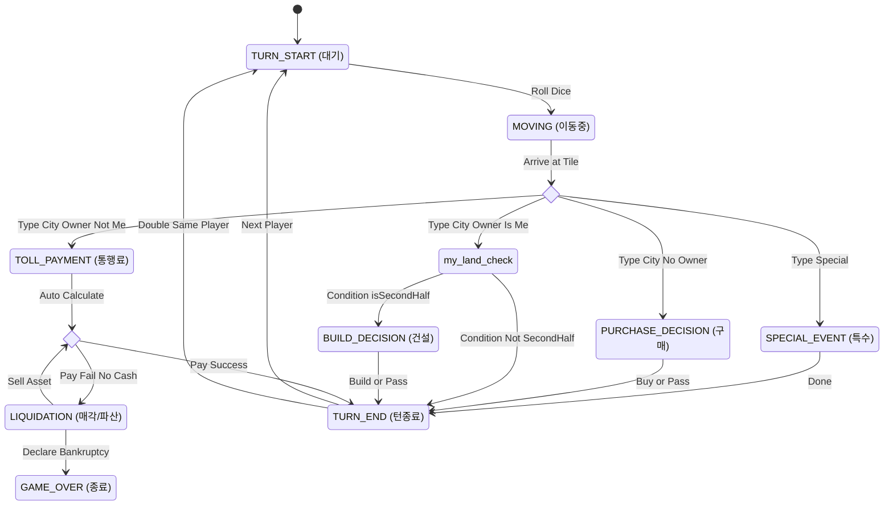

# Blue Marble - Epic Breakdown

## 개요 (Overview)

이 문서는 부루마블(Blue Marble) 프로젝트의 에픽(Epic)과 스토리(Story)에 대한 완전한 명세를 제공합니다. PRD, UX 디자인, 그리고 아키텍처 요구사항을 실제 구현 가능한 스토리로 분해합니다.

## 요구사항 인벤토리 (Requirements Inventory)

### 기능 요구사항 (Functional Requirements)

FR1: 40칸 보드 레이아웃에서 게임 플레이.
FR2: 주사위 2개 굴리기 및 "더블" 규칙 (추가 턴, 3연속 더블 = 무인도).
FR3: 주사위 합계에 따라 말 이동.
FR4: 빈 땅 도착 시 구매.
FR5: 상대방 땅 도착 시 통행료 자동 지불.
FR6: 빈 땅이 6개 남았을 때 "경매" 페이즈 발동.
FR7: 건설 페이즈 동안 건물(별장/빌딩/호텔) 건설.
FR8: "우주여행" 실행 (비용 지불 후 원하는 곳으로 이동).
FR9: "무인도" 실행 (3턴 고립 또는 더블로 탈출).
FR10: "사회복지기금" 관리 (지불/수령).
FR11: 파산 및 자산 처분 처리 (현금 -> 건물 -> 토지).
FR12: 고유한 성격(공격적/안전지향/무작위)을 가진 AI와 대전.
FR13: Seed 기반 결정론적 난수 생성 (테스트 재현성 보장).
FR14: CLI TUI 대시보드 (텍스트 기반 게임보드 및 상태 시각화).
FR13: Seed 기반 결정론적 난수 생성 (테스트 재현성 보장).
FR14: CLI TUI 대시보드 (텍스트 기반 게임보드 및 상태 시각화).
FR15: 황금열쇠 시스템 (카드 뽑기 및 효과 적용).
FR16: 특수 지역 기본 규칙 (무인도, 우주여행, 사회복지기금 - 상시 적용).

### 비기능 요구사항 (NonFunctional Requirements)

NFR1: 크로스 플랫폼 웹 & 모바일 호환성 (반응형).
NFR2: 모바일/데스크톱 60fps 성능 목표.
NFR3: 초기 로딩 시간 3초 미만.
NFR4: 모바일 기기를 위한 터치 최적화 입력.
NFR5: 복잡한 연쇄 작용에서 로직 오류 0건 (100% 무결성).

### 추가 요구사항 (Additional Requirements)

AR1: **Headless Core:** 로직 코어는 UI 없이 실행 가능해야 함 (CLI 테스트 가능).
AR2: **Hexagonal Architecture:** 코어는 어댑터 코드를 절대 임포트하지 않음 (순수성 보장).
AR3: **Redux State:** 상태는 불변이어야 함; Action/Reducer를 통해서만 업데이트.
AR4: **Effect Queue:** 연쇄적인 게임 이벤트를 처리하기 위해 Effect Queue 패턴 사용.
AR5: **Result Pattern:** 예외(Exception) 대신 `Result<T, E>`를 사용하여 로직 결과 처리.
AR6: **Type Safety:** 모든 Action에 대해 Discriminated Union 사용.
AR7: **Stress Test Support:** 10,000턴 이상의 고속 시뮬레이션 지원 (메모리 누수 방지).
AR8: **Explicit FSM States & Guards:** 게임 엔진은 아래 상태와 전이 조건을 엄격히 준수해야 함. - **Core States (States):** - **TURN_START (대기):** 주사위 굴리기 입력 대기. - **MOVING (진행):** 말이 이동 중. - **PURCHASE_DECISION (대기):** 빈 땅 도착 시 구매(Y/N) 대기. - **BUILD_DECISION (대기):** 내 땅 도착 시 건설 대기. **[진입 조건: Player.isSecondHalf == true]** - **TOLL_PAYMENT (자동):** 남의 땅 도착 시 통행료 처리. - **LIQUIDATION (대기):** 파산 위기 시 매각 대기. - **SPECIAL_EVENT (가변):** 특수 지역 로직 수행. - **Guard Conditions (Context):** - 전반전/후반전은 **상태가 아닌 조건(Condition)**임. 후반전이 아니면 `BUILD_DECISION`을 건너뛰고 턴 종료. - 파산 여부는 `TOLL_PAYMENT` 실패 시 `LIQUIDATION`으로 가는 분기 조건임.

### AR8 Reference: FSM State Diagram

### FR Coverage Map

FR1: Epic 1 - 보드 레이아웃 및 이동 기본 로직
FR2: Epic 1 - 주사위 굴리기 (Seed 포함)
FR3: Epic 1 - 말 이동
FR4: Epic 1 - 빈 땅 구매 (기본 소유권)
FR5: Epic 2 - 통행료 지불
FR6: Epic 2 - 경매 시스템 (6 Land Rule)
FR7: Epic 3 - 건물 건설 (개발 단계)
FR8: Epic 3 - 우주여행
FR9: Epic 3 - 무인도
FR10: Epic 3 - 사회복지기금
FR11: Epic 2 - 파산 시스템
FR12: Epic 4 - AI 플레이어
FR13: Epic 1 - 결정론적 난수 (Engine)
FR14: Epic 5 - CLI TUI (Dashboard)
FR15: Epic 3 - 황금열쇠

## Epic List

### Epic 1: Core Skeleton (Engine)

게임의 물리적/논리적 기반을 구축하여, '순서대로 주사위를 굴리고 말이 이동하며 땅을 사는' 기본 루프를 완성합니다. UI 없는 Headless 환경에서 100% 로직 검증을 목표로 합니다.
**FRs covered:** FR1, FR2, FR3, FR4, FR13, FR16, AR1, AR2, AR3, AR5, AR6

### Story 1.1: Project Setup & Redux Store Setup (Engine)

**사용자(개발자)로서**,
TypeScript와 Redux로 프로젝트를 초기화하고 싶습니다.
**그래야** 타입 안전성이 보장된 상태 관리 기반을 마련할 수 있기 때문입니다.

**Acceptance Criteria:**

**Given** 새로운 Node.js 환경에서
**When** 프로젝트를 초기화하면
**Then** `package.json`에 TypeScript, Redux, Vitest 의존성이 포함되어야 한다.
**And** `GameState` 인터페이스가 정의되어야 한다.
**And** 초기 상태를 가진 Redux Store가 생성되어야 한다.

### Story 1.2: Board Data Implementation (Data)

**사용자(개발자)로서**,
40칸의 정적인 보드 데이터를 정의하고 싶습니다.
**그래야** 게임 엔진이 맵의 레이아웃을 알 수 있기 때문입니다.

**Acceptance Criteria:**

**Given** 룰북에 명시된 보드 레이아웃이 주어졌을 때
**When** `BOARD_DATA` 상수에 접근하면
**Then** 40개의 Tile 객체 배열을 반환해야 한다.
**And** 인덱스 0은 "시작", 10은 "무인도", 20은 "사회복지기금", 30은 "우주여행"이어야 한다.

### Story 1.3: Deterministic Dice Roll (Logic)

**사용자(플레이어/테스터)로서**,
시드(Seed)를 사용하여 주사위 두 개 굴리고 싶습니다.
**그래야** 디버깅을 위해 정확한 게임 시나리오를 재현할 수 있기 때문입니다.

**Acceptance Criteria:**

**Given** "TEST_SEED_1"이라는 시드가 주어졌을 때
**When** 주사위를 여러 번 굴리면
**Then** 매번 동일한 숫자 시퀀스가 나와야 한다.
**And** 두 주사위 값이 같으면 "Double" 플래그가 true여야 한다.

### Story 1.4: Token Movement System (Logic)

**사용자(플레이어)로서**,
주사위 합계만큼 내 말을 전진시키고 싶습니다.
**그래야** 보드 위를 이동할 수 있기 때문입니다.

**Acceptance Criteria:**

**Given** 플레이어가 인덱스 0(시작)에 있고 주사위가 5가 나왔을 때
**When** Move 액션이 디스패치되면
**Then** 플레이어 위치가 5로 업데이트되어야 한다.
**And** 위치가 39를 초과하면 0부터 다시 순환(modulo 40)해야 하며, 출발지를 통과하면 월급을 지급받아야 한다.

### Story 1.5: Vacant Land Purchase (Economy)

**사용자(플레이어)로서**,
주인이 없는 땅에 도착했을 때 그 땅을 구매하고 싶습니다.
**그래야** 자산을 소유할 수 있기 때문입니다.

**Acceptance Criteria:**

**Given** 주인이 없는 도시 칸에 도착했을 때
**When** Buy 액션이 디스패치되면
**Then** 플레이어의 현금이 땅 가격만큼 감소해야 한다.
**And** 해당 타일의 소유자가 플레이어 ID로 업데이트되어야 한다.
**And** 플레이어 자금이 부족하면 실패해야 한다.

### Story 1.6: Turn Management (Flow)

**사용자(시스템)로서**,
다음 플레이어에게 턴을 넘기고 싶습니다.
**그래야** 게임 루프가 진행되기 때문입니다.

**Acceptance Criteria:**

**Given** 플레이어 1이 행동을 마쳤을 때
**When** EndTurn 액션이 디스패치되면
**Then** 현재 플레이어 인덱스가 플레이어 2로 업데이트되어야 한다.
**And** 만약 플레이어 1이 더블을 쳤다면, 여전히 플레이어 1의 턴이어야 한다(추가 턴).

### Story 1.7: Special Tile Mechanics (Rules)

**사용자(플레이어)로서**,
특수 칸(무인도, 우주여행, 사회복지기금, 황금열쇠)에 도착했을 때 특별한 규칙이 적용되길 원합니다.
**그래야** 기본 규칙에 따라 보드가 올바르게 동작하기 때문입니다.

**Acceptance Criteria:**

**Given** 특정 특수 칸에 도착했을 때
**When** 도착 이벤트가 처리되면
**Then** "무인도"는 플레이어 상태를 잠금(3턴) 처리해야 한다.
**And** "우주여행"은 '다음 턴 원하는 곳 이동' 상태를 설정해야 한다.
**And** "사회복지기금"은 기부 또는 수령 액션을 트리거해야 한다.
**And** "황금열쇠"는 덱에서 카드를 한 장 뽑아야 한다.

### Epic 2: Basic Economy (Trade & Competition)

'자산'과 '화폐'의 개념을 도입하여 가장 기본적인 토지 거래와 경제 활동(통행료, 경매, 파산)이 가능하게 합니다. 게임의 승패 사이클을 완성합니다.
**FRs covered:** FR5, FR6, FR11, AR4

### Story 2.1: Toll Payment System (Economy)

**사용자(플레이어)로서**,
상대방 땅에 도착했을 때 자동으로 통행료를 지불하고 싶습니다.
**그래야** 자산의 순환이 일어나기 때문입니다.

**Acceptance Criteria:**

**Given** 플레이어 A가 플레이어 B의 땅에 도착하고
**And** 플레이어 A에게 충분한 현금이 있을 때
**When** 통행료 계산이 실행되면
**Then** 플레이어 A의 현금이 통행료만큼 감소해야 한다.
**And** 플레이어 B의 현금이 통행료만큼 증가해야 한다.

### Story 2.2: Bankruptcy Logic (System)

**사용자(시스템)로서**,
플레이어가 지불 능력이 없을 때 파산을 선언하고 싶습니다.
**그래야** 해당 플레이어의 게임을 종료시킬 수 있기 때문입니다.

**Acceptance Criteria:**

**Given** 플레이어가 요구 금액(통행료/세금)을 지불할 수 없고
**And** 처분 가능한 자산(현금/부동산)이 없을 때
**When** 지불이 실패하면
**Then** 플레이어 상태가 "파산(Bankrupt)"으로 설정되어야 한다.
**And** 남은 자산은 채권자(또는 은행)에게 양도되어야 한다.

### Story 2.3: Asset Liquidation System (Economy)

**사용자(플레이어)로서**,
현금이 부족할 때 내 건물이나 땅을 매각하고 싶습니다.
**그래야** 빚을 갚고 파산을 면할 수 있기 때문입니다.

**Acceptance Criteria:**

**Given** 현금이 부족하지만 부동산을 소유하고 있을 때
**When** 매각(Liquidation) 모드가 발동되면
**Then** 건물(100% 환불) 또는 땅(50% 환불)을 선택하여 매각할 수 있어야 한다.
**And** 매각 즉시 플레이어의 현금이 업데이트되어야 한다.

### Story 2.4: Auction System (6 Land Rule) (Mechanic)

**사용자(시스템)로서**,
빈 땅이 6개 이하로 남았을 때 강제 경매를 발동하고 싶습니다.
**그래야** 게임 진행 속도를 높일 수 있기 때문입니다.

**Acceptance Criteria:**

**Given** 빈 땅이 7개 남아있을 때
**When** 플레이어가 7번째 마지막 땅을 구매하여 (6개가 남으면)
**Then** 게임 상태가 "AuctionPhase"로 전환되어야 한다.
**And** 남은 6개의 땅이 차례대로 경매에 부쳐져야 한다.

### Epic 3: Advanced Mechanics (Game Logic)

황금열쇠, 우주여행, 무인도 등 부루마블의 고유한 재미 요소와 심화 규칙들을 구현하여 게임의 완성도를 높입니다.
**FRs covered:** FR7, FR8, FR9, FR10, FR15

### Story 3.1: Phase System Implementation (Engine)

**사용자(시스템)로서**,
게임 페이즈(초반/경매/개발)를 관리하고 싶습니다.
**그래야** 게임 진행도에 따라 규칙을 동적으로 변경할 수 있기 때문입니다.

**Acceptance Criteria:**

**Given** 빈 땅의 개수가 6개로 떨어졌을 때
**When** 구매 이벤트가 발생하면
**Then** 게임 페이즈가 "Early"에서 "Auction"으로 전환되어야 한다.
**And** 모든 땅이 판매된 후에는 "Development"로 전환되어야 한다.

### Story 3.2: Construction System (Development Phase) (Economy)

**사용자(플레이어)로서**,
개발 단계(Development Phase) 동안 내 땅에 건물(별장/빌딩/호텔)을 짓고 싶습니다.
**그래야** 통행료 수입을 극대화할 수 있기 때문입니다.

**Acceptance Criteria:**

**Given** 게임이 "Development" 페이즈이고
**And** 본인 소유의 도시 칸에 도착했을 때
**When** 건물 타입을 선택하여 건설 액션을 디스패치하면
**Then** 플레이어 현금이 건설 비용만큼 감소해야 한다.
**And** 타일의 건물 상태가 업데이트되어야 한다 (별장 최대 2채, 빌딩 최대 1채, 호텔 최대 1채).
**And** 통행료 계산 공식에 새 건물이 반영되어야 한다.

### Story 3.3: Complex Golden Keys (Event)

**사용자(플레이어)로서**,
복잡한 황금열쇠 효과(예: 카드 보관, 할인 등)를 사용하고 싶습니다.
**그래야** 전략적으로 황금열쇠를 활용할 수 있기 때문입니다.

**Acceptance Criteria:**

**Given** "무인도 탈출권" 같은 우대권을 뽑았을 때
**When** 뽑기(Draw) 이벤트가 발생하면
**Then** 카드가 즉시 실행되지 않고 플레이어 인벤토리에 추가되어야 한다.
**And** 나중에 무인도에 갇혔을 때 "카드 사용"을 선택할 수 있어야 한다.

### Epic 4: Single Player (AI & Simulation)

혼자서도 테스트 및 플레이가 가능하도록 인공지능 상대를 구현하고, 대규모 시뮬레이션을 통해 밸런스와 안정성을 검증합니다.
**FRs covered:** FR12, AR7

### Story 4.1: AI Interface & Decision Maker (AI)

**사용자(개발자)로서**,
게임 상태에 따라 결정을 내리는 AI 에이전트를 만들고 싶습니다.
**그래야** 컴퓨터와 대전하거나 시뮬레이션을 돌릴 수 있기 때문입니다.

**Acceptance Criteria:**

**Given** AI 플레이어의 턴일 때
**When** 입력 요청이 들어오면
**Then** AI는 상태(돈, 위치)를 분석해야 한다.
**And** 사람의 개입 없이 유효한 액션(Roll, Buy 등)을 반환해야 한다.
**And** 적어도 "Random"과 "Purchase-All(닥치고 구매)" 전략 모드를 지원해야 한다.

### Story 4.2: Simulation Runner (Headless) (Testing)

**사용자(테스터)로서**,
AI 에이전트 간의 1000턴 헤드리스(UI 없는) 시뮬레이션을 실행하고 싶습니다.
**그래야** 게임의 안정성과 메모리 사용량을 검증할 수 있기 때문입니다.

**Acceptance Criteria:**

**Given** 두 명의 AI 플레이어가 있을 때
**When** 시뮬레이션 스크립트가 실행되면
**Then** 승자가 결정되거나 턴 제한에 도달할 때까지 게임이 반복되어야 한다.
**And** 최종 통계(승자, 총 자산, 턴 수)가 로그로 남아야 한다.
**And** 1초 이내에 완료되어야 한다(성능 체크).

### Epic 5: CLI UX Polish (TUI)

개발자용 로그 텍스트를 직관적인 대시보드 형태의 TUI(Text User Interface)로 시각화하여, 플레이 가능한 수준의 경험을 제공합니다.
**FRs covered:** FR14, NFR4(Foundation)

### Story 5.1: Dashboard View (UX)

**사용자(플레이어)로서**,
구조화된 텍스트 레이아웃으로 보드와 플레이어 상태를 보고 싶습니다.
**그래야** 게임 진행 상황을 명확히 이해할 수 있기 때문입니다.

**Acceptance Criteria:**

**Given** 게임 상태가 업데이트될 때
**When** 화면이 렌더링되면
**Then** 콘솔을 지워야 한다(Clear).
**And** 40칸 보드를 그려야 한다(ASCII/박스 드로잉).
**And** 플레이어 돈, 자산, 위치를 사이드 패널에 표시해야 한다.

### Story 5.2: Inquirer Controller (UX)

**사용자(플레이어)로서**,
키보드 방향키나 프롬프트를 사용하여 게임을 제어하고 싶습니다.
**그래야** JSON 명령어를 수동으로 입력하지 않아도 되기 때문입니다.

**Acceptance Criteria:**

**Given** 인간 플레이어의 턴일 때
**When** 액션이 필요하면
**Then** 시스템은 `inquirer` 같은 라이브러리를 사용해 옵션(주사위/구매/종료)을 제시해야 한다.
**And** 선택된 옵션은 올바른 Redux 액션을 디스패치해야 한다.
