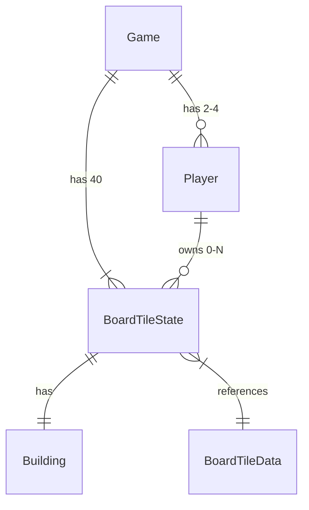

# Data Model: 부루마블 MVP 핵심 엔진 (테스트 모드)

**Feature**: 001-core-game-engine
**Date**: 2026-01-10
**Source**: spec.md + contracts/

## Entities

### Game

게임 전체 상태를 관리하는 최상위 엔티티

```typescript
interface Game {
  id: string;
  status: GameStatus; // 'waiting' | 'playing' | 'finished'
  players: Player[]; // 2~4명
  currentPlayerIndex: number; // 현재 턴 플레이어 인덱스
  turnOrder: string[]; // 플레이어 ID 순서 (랜덤 결정)
  board: BoardTileState[]; // 40칸 상태
  lastDiceResult?: DiceResult; // 마지막 주사위 결과
  createdAt: Date;
}

interface DiceResult {
  die1: number; // 1~6
  die2: number; // 1~6
  total: number; // 2~12
  isDouble: boolean; // 더블 여부
}

enum GameStatus {
  WAITING = "waiting",
  PLAYING = "playing",
  FINISHED = "finished",
}
```

### Player

플레이어 정보

```typescript
interface Player {
  id: string;
  name: string;
  color: PlayerColor; // 'red' | 'blue' | 'yellow' | 'green'
  position: number; // 0~39 (현재 위치)
  money: number; // 현금 (초기: 2,000,000)
  ownedTileIds: string[]; // 소유한 땅 ID 목록
  isBankrupt: boolean; // 파산 여부
  isSecondHalf: boolean; // 후반전 상태 (출발점 1회 이상 통과 시 true)
}

enum PlayerColor {
  RED = "red",
  BLUE = "blue",
  YELLOW = "yellow",
  GREEN = "green",
}
```

### BoardTileState

각 칸의 현재 상태 (소유권, 건물 등)

```typescript
interface BoardTileState {
  id: string; // 'tile-0' ~ 'tile-39'
  ownerId?: string; // 소유자 플레이어 ID (null이면 미소유)
  buildings: Building; // 건물 현황
}

/** 건물 현황 (독립 건설 방식) */
interface Building {
  villaCount: 0 | 1 | 2; // 별장 개수 (최대 2개)
  hasBuilding: boolean; // 빌딩 유무 (최대 1개)
  hasHotel: boolean; // 호텔 유무 (최대 1개)
}
```

### BoardTileData (Static)

보드판 칸의 정적 데이터 (contracts/board-data.ts 참조)

```typescript
interface BoardTileData {
  id: string;
  index: number; // 0~39
  name: string;
  type: TileType;
  colorGroup?: string; // 독점 판정용 색상 그룹
  price?: number; // 구매가
  buildingPrices?: {
    villa: number;
    building: number;
    hotel: number;
  };
  rentTable?: RentTable; // 통행료 테이블
  canBuild: boolean; // 건설 가능 여부
}

/** 통행료 테이블 (합산 방식용) */
interface RentTable {
  land: number; // 대지료
  villa1: number; // 별장 1개
  villa2: number; // 별장 2개 (추가분)
  building: number; // 빌딩
  hotel: number; // 호텔
}

enum TileType {
  START = "start",
  PROPERTY = "property",
  VEHICLE = "vehicle",
  GOLDEN_KEY = "goldenKey", // MVP에서 미사용
  ISLAND = "island", // MVP에서 미사용
  TRAVEL = "travel", // MVP에서 미사용
  FUND_RECEIVE = "fundReceive", // MVP에서 미사용
  FUND_DONATE = "fundDonate", // MVP에서 미사용
}
```

## Relationships



## Key Calculations

### 1. 통행료 계산 (합산 방식)

```typescript
function calculateToll(
  tileData: BoardTileData,
  tileState: BoardTileState,
  isMonopoly: boolean
): number {
  if (!tileData.rentTable || !tileState.ownerId) return 0;

  const { buildings } = tileState;
  const { rentTable } = tileData;

  let toll = rentTable.land;
  if (buildings.villaCount >= 1) toll += rentTable.villa1;
  if (buildings.villaCount >= 2) toll += rentTable.villa2;
  if (buildings.hasBuilding) toll += rentTable.building;
  if (buildings.hasHotel) toll += rentTable.hotel;

  if (isMonopoly) toll *= 2;

  return toll;
}
```

### 2. 독점 판정

```typescript
function isMonopoly(
  playerId: string,
  colorGroup: string,
  allTileStates: BoardTileState[],
  allTileData: BoardTileData[]
): boolean {
  const tilesInGroup = allTileData.filter((t) => t.colorGroup === colorGroup);
  return tilesInGroup.every(
    (t) => allTileStates.find((s) => s.id === t.id)?.ownerId === playerId
  );
}
```

### 3. 총 자산 계산

```typescript
function calculateNetWorth(
  player: Player,
  tileStates: BoardTileState[],
  tileData: BoardTileData[]
): number {
  let worth = player.money;

  for (const tileId of player.ownedTileIds) {
    const data = tileData.find((t) => t.id === tileId);
    const state = tileStates.find((t) => t.id === tileId);
    if (!data || !state) continue;

    // 땅 가치 (50%)
    worth += (data.price ?? 0) * 0.5;

    // 건물 가치 (100%)
    if (data.buildingPrices) {
      worth += state.buildings.villaCount * data.buildingPrices.villa;
      if (state.buildings.hasBuilding) worth += data.buildingPrices.building;
      if (state.buildings.hasHotel) worth += data.buildingPrices.hotel;
    }
  }

  return worth;
}
```

## Constants

```typescript
// 게임 상수 (spec.md 참조)
const GAME_CONSTANTS = {
  INITIAL_MONEY: 2_000_000, // 초기 자금
  MAX_PLAYERS: 4, // 최대 플레이어
  MIN_PLAYERS: 2, // 최소 플레이어
  BOARD_TILES: 40, // 총 칸 수
  SALARY: 200_000, // 월급
  MONOPOLY_MULTIPLIER: 2, // 독점 배수
  LAND_SELL_RATE: 0.5, // 땅 매각 시 환급률
  BUILDING_SELL_RATE: 1.0, // 건물 매각 시 환급률
} as const;
```
