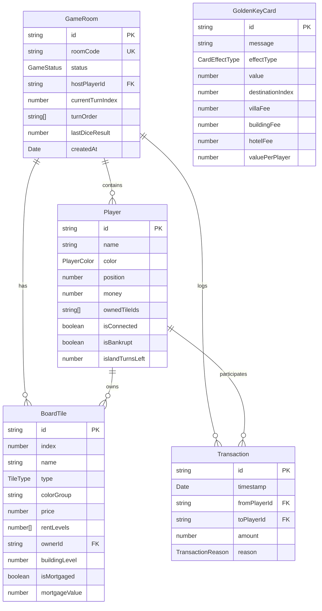
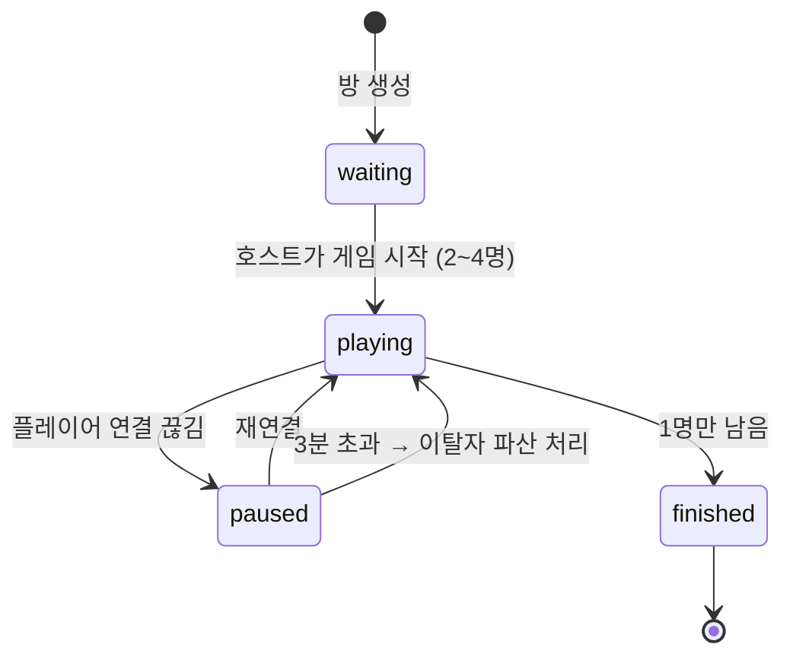
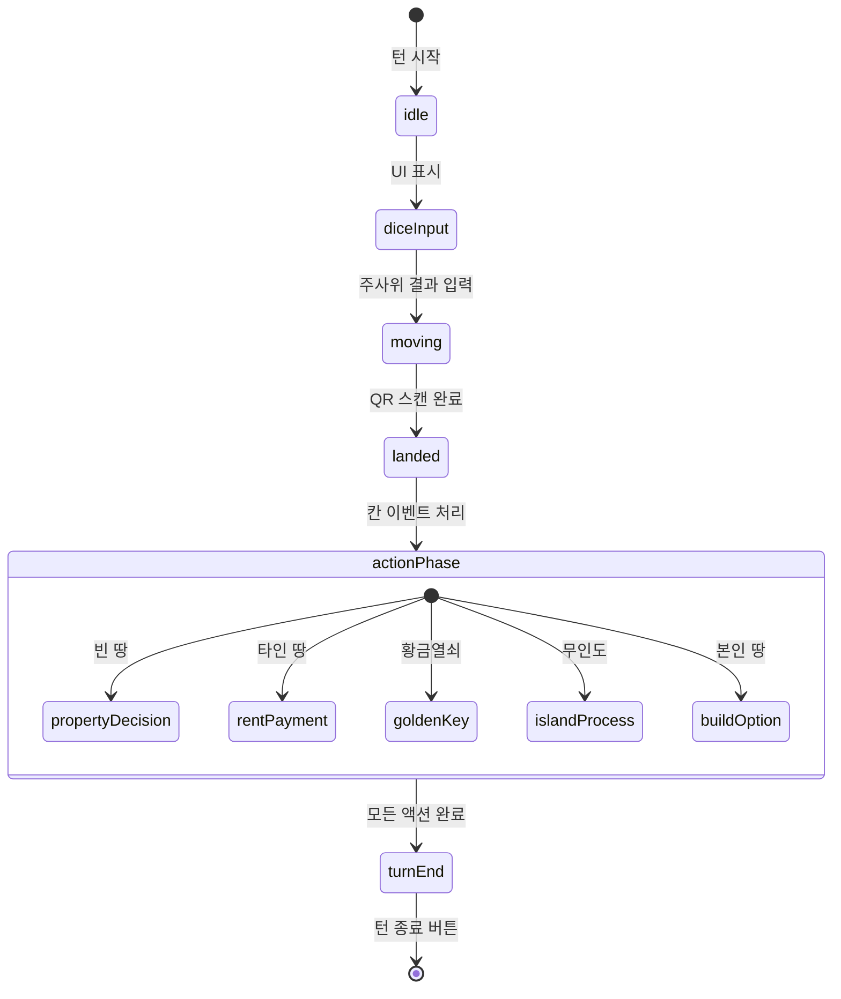

# Data Model: 부루마블 핵심 게임 엔진

**Feature**: 001-core-game-engine  
**Date**: 2026-01-04  
**Status**: Complete

## Overview

부루마블 핵심 게임 엔진의 데이터 모델을 TypeScript 인터페이스로 정의한다.

---

## Entity Relationship Diagram



---

## TypeScript Interfaces

### Enums

```typescript
// server/src/models/enums.ts

export enum GameStatus {
  WAITING = "waiting",
  PLAYING = "playing",
  PAUSED = "paused",
  FINISHED = "finished",
}

export enum PlayerColor {
  RED = "red",
  BLUE = "blue",
  YELLOW = "yellow",
  WHITE = "white", // 원본 규칙: 빨강/파랑/노랑/흰색 비행기 말
}

export enum BuildingLevel {
  LAND = 0, // 대지만
  VILLA = 1, // 별장
  VILLA2 = 2, // 별장 2개
  BUILDING = 3, // 빌딩
  HOTEL = 4, // 호텔
}

export enum TileType {
  START = "start", // 출발
  PROPERTY = "property", // 도시 (부동산)
  VEHICLE = "vehicle", // 탈것 (콩코드, 퀄엘리자베스, 컴럼비아)
  GOLDEN_KEY = "goldenKey", // 황금열쇠
  ISLAND = "island", // 무인도
  TRAVEL = "travel", // 우주여행
  FUND_RECEIVE = "fundReceive", // 사회복지기금 접수 (수령처, 코너)
  FUND_DONATE = "fundDonate", // 사회복지기금 기부 (모금 칸)
}

export enum CardEffectType {
  MOVE_TO = "moveTo", // 특정 위치로 이동
  MOVE_BACK = "moveBack", // 뒤로 N칸 이동
  WORLD_TOUR = "worldTour", // 세계일주 (한 바퀴)
  RECEIVE = "receive", // 돈 받기 (상금)
  PAY = "pay", // 돈 지불 (지출)
  COLLECT_FROM_ALL = "collectFromAll", // 모든 플레이어에게 받기
  BUILDING_FEE = "buildingFee", // 건물 유지비/수리비/방범비
  FORCE_SELL = "forceSell", // 가장 비싼 땅 반값 매각
  ISLAND_ESCAPE = "islandEscape", // 무인도 탈출권 (보관 가능)
  TOLL_EXEMPT = "tollExempt", // 통행료 면제권 (보관 가능)
  TO_ISLAND = "toIsland", // 무인도로 이동
  SPECIAL = "special", // 특수 효과 (장기자랑 등)
}

export enum TransactionReason {
  RENT = "rent", // 통행료
  PURCHASE = "purchase", // 땅 구매
  BUILD = "build", // 건물 건설
  GOLDEN_KEY = "goldenKey", // 황금열쇠 효과
  SALARY = "salary", // 월급 (출발 통과)
  MORTGAGE = "mortgage", // 담보 설정
  MORTGAGE_RELEASE = "mortgageRelease", // 담보 해제
  BANKRUPTCY = "bankruptcy", // 파산 자산 이전
  FUND_DONATE = "fundDonate", // 사회복지기금 기부
  FUND_RECEIVE = "fundReceive", // 사회복지금 수령
  TRAVEL_FEE = "travelFee", // 우주여행 이용료
  ISLAND_ESCAPE = "islandEscape", // 무인도 탈출 비용
  FORCE_SELL = "forceSell", // 강제 매각
}

export enum TurnPhase {
  IDLE = "idle",
  DICE_INPUT = "diceInput",
  MOVING = "moving",
  LANDED = "landed",
  ACTION_PHASE = "actionPhase",
  TURN_END = "turnEnd",
}
```

### Game Room

```typescript
// server/src/models/game-room.ts

import { Player } from "./player";
import { BoardTile } from "./board-tile";
import { Transaction } from "./transaction";
import { GameStatus, TurnPhase } from "./enums";

export interface GameRoom {
  /** Unique identifier (UUID) */
  id: string;

  /** 6-character room code for joining */
  roomCode: string;

  /** Current game status */
  status: GameStatus;

  /** ID of the player who created the room */
  hostPlayerId: string;

  /** All players in the room (max 4) */
  players: Player[];

  /** Current turn's player index in turnOrder */
  currentTurnIndex: number;

  /** Player IDs in turn order (randomized at game start) */
  turnOrder: string[];

  /** Last dice result (1-12) */
  lastDiceResult: number | null;

  /** Current turn phase */
  turnPhase: TurnPhase;

  /** Board tiles with game-specific state */
  tiles: BoardTile[];

  /** Transaction history */
  transactions: Transaction[];

  /** Room creation timestamp */
  createdAt: Date;

  /** Disconnected player ID (if paused) */
  disconnectedPlayerId: string | null;

  /** 사회복지기금 적립금 (모금 칸에서 누적, 수령처에서 전액 지급) */
  fundPool: number;
}
```

### Player

```typescript
// server/src/models/player.ts

import { PlayerColor } from "./enums";

export interface Player {
  /** Unique identifier (UUID) */
  id: string;

  /** Display name */
  name: string;

  /** Assigned color (based on join order) */
  color: PlayerColor;

  /** Current board position (0-39, 40칸 보드판) */
  position: number;

  /** Current money in won (starts at 2,000,000) */
  money: number;

  /** IDs of owned tiles */
  ownedTileIds: string[];

  /** WebSocket connection status */
  isConnected: boolean;

  /** Bankruptcy status */
  isBankrupt: boolean;

  /** Remaining turns stuck on island (0 = not on island) */
  islandTurnsLeft: number;

  /** Socket ID for WebSocket communication */
  socketId: string;
}

/** Constants */
export const INITIAL_MONEY = 2_000_000;
export const MAX_PLAYERS = 4;
```

### Board Tile

import { TileType, BuildingLevel } from "./enums";

export interface BoardTile {
/\*_ Unique identifier _/
id: string;

/\*_ Board position (0-39, 40칸 보드판) _/
index: number;

/\*_ Display name (city/vehicle) _/
name: string;

/\*_ Tile type _/
type: TileType;

/\*_ Color group for monopoly detection (property only) _/
colorGroup?: string;

/\*_ Purchase price _/
price?: number;

/\*_ Building prices: [별장, 빌딩, 호텔] (only if canBuild = true) _/
buildingPrices?: [number, number, number];

/\*_ Rent levels: [대지, 별장, 별장2개, 빌딩, 호텔] (5단계) _/
rentLevels?: [number, number, number, number, number];

/\*_ Whether buildings can be constructed _/
canBuild?: boolean;

/\*_ Current owner's player ID (null = unowned) _/
ownerId: string | null;

/\*_ Building level: 0=land, 1=villa, 2=villa2, 3=building, 4=hotel _/
buildingLevel: BuildingLevel;

/\*_ Mortgage status _/
isMortgaged: boolean;

/\*_ Current mortgage value (if mortgaged) _/
mortgageValue?: number;
}

/\*_ Constants _/
export const BOARD_SIZE = 40;
export const MORTGAGE_RATE = 0.5;
export const MORTGAGE_INTEREST = 0.1;
export const MONOPOLY_MULTIPLIER = 2;

````

### Golden Key Card

```typescript
// server/src/models/golden-key-card.ts

import { CardEffectType } from "./enums";

export interface GoldenKeyCard {
  /** Unique identifier */
  id: string;

  /** Display message */
  message: string;

  /** Effect type */
  effectType: CardEffectType;

  /** Money amount (receive/pay) */
  value?: number;

  /** Target tile index (move) */
  destinationIndex?: number;

  /** Repair costs per building type */
  villaFee?: number;
  buildingFee?: number;
  hotelFee?: number;

  /** Amount per player (collectFromAll/payToAll) */
  valuePerPlayer?: number;
}

/** Constants */
export const GOLDEN_KEY_COUNT = 27;
````

### Transaction

```typescript
// server/src/models/transaction.ts

import { TransactionReason } from "./enums";

export interface Transaction {
  /** Unique identifier (UUID) */
  id: string;

  /** Transaction timestamp */
  timestamp: Date;

  /** Source player ID (null = bank) */
  fromPlayerId: string | null;

  /** Destination player ID (null = bank) */
  toPlayerId: string | null;

  /** Amount in won */
  amount: number;

  /** Transaction reason */
  reason: TransactionReason;

  /** Optional description */
  description?: string;
}
```

---

## Validation Rules

### GameRoom

- `roomCode`: 6자리 영숫자, 고유해야 함
- `players.length`: 1 ≤ n ≤ 4
- `turnOrder.length` === `players.filter(p => !p.isBankrupt).length`
- `status === 'playing'` 일 때만 게임 액션 허용

### Player

- `name`: 1~20자
- `money`: 0 이상 (음수 불가, 음수 시 파산 처리)
- `position`: 0~31
- `islandTurnsLeft`: 0~3

### BoardTile

- `buildingLevel`: 0~3
- `buildingLevel > 0` 이면 `isMortgaged === false`
- 담보 설정 시 건물은 유지 (담보 해제 전 건설 불가)

### Transaction

- `amount`: 양수
- `fromPlayerId !== toPlayerId`

---

## State Transitions

### Game Status



### Turn Phase



---

## Index File

```typescript
// server/src/models/index.ts

export * from "./enums";
export * from "./game-room";
export * from "./player";
export * from "./board-tile";
export * from "./golden-key-card";
export * from "./transaction";
```
