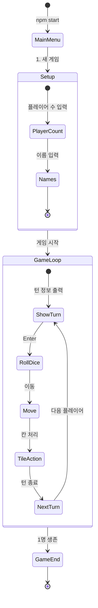

# Quickstart: 부루마블 MVP 핵심 엔진 (CLI 테스트 모드)

**Feature**: 001-core-game-engine
**Date**: 2026-01-10

## Prerequisites

- Node.js 18+
- npm 9+ 또는 pnpm 8+

## Setup

```bash
# 1. 저장소 이동
cd e:/github_coop/blue-marble

# 2. 의존성 설치
npm install

# 3. 빌드
npm run build

# 4. 게임 실행
npm start
```

## Project Structure

```text
blue-marble/
├── src/
│   ├── cli/                  # CLI 입출력
│   │   ├── prompts.ts        # 사용자 입력 처리
│   │   ├── display.ts        # 화면 출력 포매터
│   │   └── gameLoop.ts       # 메인 게임 루프
│   ├── services/             # 비즈니스 로직
│   │   ├── gameService.ts    # 게임 흐름
│   │   ├── diceService.ts    # 주사위
│   │   ├── propertyService.ts # 땅 구매
│   │   ├── buildingService.ts # 건물 건설
│   │   ├── tollCalculator.ts  # 통행료 계산
│   │   └── bankruptcyService.ts # 파산 처리
│   ├── data/                 # 정적 데이터
│   │   ├── boardData.ts      # 40칸 보드판
│   │   └── constants.ts      # 게임 상수
│   ├── types/                # TypeScript 타입
│   │   └── index.ts
│   └── index.ts              # 엔트리 포인트
├── tests/                    # 테스트
│   └── unit/
├── package.json
└── tsconfig.json
```

## Key Commands

```bash
# 개발 모드 (ts-node)
npm run dev

# 빌드
npm run build

# 실행
npm start

# 테스트
npm run test
```

## Game Flow



## Example Session

```
$ npm start

=== 부루마블 테스트 모드 ===
1. 새 게임 시작
2. 종료
선택: 1

플레이어 수를 입력하세요 (2-4): 2
플레이어 1 이름: Alice
플레이어 2 이름: Bob

게임을 시작합니다!
턴 순서: Alice → Bob

========================================
[턴 1] Alice의 차례 (현재 위치: 출발)
잔고: ₩2,000,000 | 소유 땅: 없음
========================================
[Enter] 주사위 굴리기
>

주사위: [3] + [4] = 7
이동: 출발(0) → 싱가포르(7)

--- 싱가포르 ---
소유자: 없음 | 가격: ₩100,000
구매하시겠습니까? (Y/N): y

✓ 싱가포르 구매 완료!
잔고: ₩2,000,000 → ₩1,900,000

[Enter] 턴 종료
>

========================================
[턴 2] Bob의 차례 (현재 위치: 출발)
...
```
