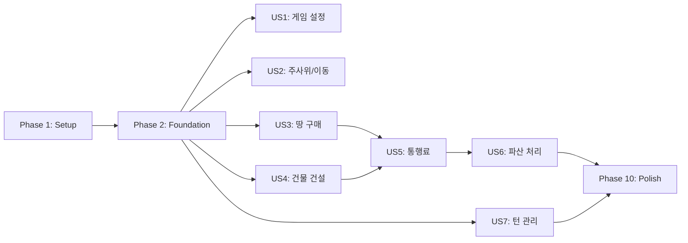

# Tasks: 부루마블 MVP 핵심 엔진 (CLI 테스트 모드)

**Input**: Design documents from `/specs/001-core-game-engine/`
**Prerequisites**: plan.md ✅, spec.md ✅, research.md ✅, data-model.md ✅, quickstart.md ✅

**Tests**: 선택적 - 별도 요청 시 추가

**Organization**: 7개 User Story를 Phase별로 구조화

## Format: `[ID] [P?] [Story] Description`

- **[P]**: 병렬 실행 가능
- **[Story]**: 해당 User Story (US1~US7)

---

## Phase 1: Setup (프로젝트 초기화)

**Purpose**: Node.js CLI 프로젝트 기본 구조

- [x] T001 Create Node.js project with package.json (name: blue-marble-cli)
- [x] T002 Install dev dependencies: typescript, ts-node, vitest in package.json
- [x] T003 [P] Configure TypeScript (tsconfig.json) with strict mode, ES2022
- [x] T004 [P] Add npm scripts: dev (ts-node), build (tsc), start, test
- [x] T005 Create src/ directory structure per plan.md

---

## Phase 2: Foundational (핵심 타입 및 데이터)

**Purpose**: 모든 User Story가 의존하는 핵심 타입과 정적 데이터

- [x] T006 Define core types (Game, Player, BoardTileState, Building) in src/types/index.ts
- [x] T007 Define GameStatus, TileType enums in src/types/index.ts
- [x] T008 [P] Create RentTable interface for additive toll calculation in src/types/index.ts
- [x] T009 [P] Create DiceResult interface in src/types/index.ts
- [x] T010 Create 40-tile board data based on contracts/board-data.ts in src/data/boardData.ts
- [x] T011 [P] Define GAME_CONSTANTS in src/data/constants.ts
- [x] T012 Create readline wrapper with async prompt in src/cli/prompts.ts

**Checkpoint**: 타입, 데이터, 기본 CLI 구조 완료

---

## Phase 3: User Story 1 - 게임 설정 및 시작 (Priority: P1) 🎯 MVP

**Goal**: 터미널에서 플레이어 수와 이름을 입력하여 게임을 시작

**Independent Test**: `npm start` → 플레이어 수 3 입력 → 이름 3개 입력 → 턴 순서 출력

### Implementation

- [ ] T013 [P] [US1] Implement initializeGame() in src/services/gameService.ts
- [ ] T014 [P] [US1] Implement generateTurnOrder() in src/services/gameService.ts
- [ ] T015 [US1] Create displayMainMenu() in src/cli/display.ts
- [ ] T016 [US1] Create promptPlayerCount() in src/cli/prompts.ts
- [ ] T017 [US1] Create promptPlayerNames() in src/cli/prompts.ts
- [ ] T018 [US1] Create displayGameStart() in src/cli/display.ts
- [ ] T019 [US1] Implement main menu and setup flow in src/index.ts

**Checkpoint**: 게임 설정 완료 - `npm start`로 테스트 가능

---

## Phase 4: User Story 2 - 주사위 굴리기 및 이동 (Priority: P1)

**Goal**: Enter 입력으로 주사위 굴림, 이동, 출발 통과 월급

**Independent Test**: Enter → 주사위 값 출력 → 이동 후 새 위치 출력

### Implementation

- [ ] T020 [P] [US2] Implement rollDice() in src/services/diceService.ts
- [ ] T021 [P] [US2] Implement movePlayer() with position wrap in src/services/gameService.ts
- [ ] T022 [US2] Implement handlePassStart() for salary + isSecondHalf=true in src/services/gameService.ts
- [ ] T023 [US2] Create displayTurnInfo() in src/cli/display.ts
- [ ] T024 [US2] Create displayDiceResult() in src/cli/display.ts
- [ ] T025 [US2] Create displayMovement() in src/cli/display.ts
- [ ] T026 [US2] Integrate dice/move into game loop in src/cli/gameLoop.ts

**Checkpoint**: 주사위 및 이동 완료 (출발 통과 시 후반전 전환 포함)

---

## Phase 5: User Story 3 - 땅 구매 (Priority: P1)

**Goal**: 빈 땅 도착 시 Y/N 입력으로 구매/패스

**Independent Test**: 빈 땅 도착 → "구매하시겠습니까? (Y/N)" → Y 입력 → 구매 완료

### Implementation

- [ ] T027 [P] [US3] Implement canAffordPurchase() in src/services/propertyService.ts
- [ ] T028 [P] [US3] Implement purchaseProperty() in src/services/propertyService.ts
- [ ] T029 [US3] Create displayTileInfo() in src/cli/display.ts
- [ ] T030 [US3] Create promptPurchase() (Y/N) in src/cli/prompts.ts
- [ ] T031 [US3] Implement empty tile landing in src/cli/gameLoop.ts

**Checkpoint**: 땅 구매 완료

---

## Phase 6: User Story 4 - 건물 건설 (Priority: P1)

**Goal**: 본인 땅 도착 시 메뉴 번호로 건물 건설 (후반전 상태일 때만)

**Independent Test**: 후반전 상태 + 본인 땅 도착 → 건설 메뉴 → 1 입력 → 별장 건설 완료

### Implementation

- [ ] T032 [P] [US4] Implement canBuildVilla/Building/Hotel() with isSecondHalf check in src/services/buildingService.ts
- [ ] T033 [US4] Implement buildVilla(), buildBuilding(), buildHotel() in src/services/buildingService.ts
- [ ] T034 [US4] Create displayBuildingMenu() with "전반전입니다" message in src/cli/display.ts
- [ ] T035 [US4] Create promptBuildingChoice() in src/cli/prompts.ts
- [ ] T036 [US4] Implement owned tile landing with secondHalf check in src/cli/gameLoop.ts

**Checkpoint**: 건물 건설 완료 (전반전/후반전 체크 포함)

---

## Phase 7: User Story 5 - 통행료 지불 (Priority: P1)

**Goal**: 타인 땅 도착 시 합산 통행료 계산 및 지불

**Independent Test**: 타인 땅(별장2+빌딩) 도착 → 합산 통행료 출력 → 자동 지불

### Implementation

- [ ] T037 [P] [US5] Implement calculateToll() with additive formula in src/services/tollCalculator.ts
- [ ] T038 [P] [US5] Implement isMonopoly() in src/services/tollCalculator.ts
- [ ] T039 [US5] Implement payToll() in src/services/tollCalculator.ts
- [ ] T040 [US5] Create displayTollPayment() in src/cli/display.ts
- [ ] T041 [US5] Implement opponent tile landing in src/cli/gameLoop.ts

**Checkpoint**: 통행료 지불 완료

---

## Phase 8: User Story 6 - 파산 처리 (Priority: P1)

**Goal**: 잔고 부족 시 매각 메뉴로 자산 매각 또는 파산

**Independent Test**: 잔고 부족 → 매각 메뉴 → 번호 선택 → 매각/파산

### Implementation

- [ ] T042 [P] [US6] Implement canAfford() in src/services/bankruptcyService.ts
- [ ] T043 [P] [US6] Implement sellBuilding() (100% refund) in src/services/bankruptcyService.ts
- [ ] T044 [P] [US6] Implement sellLand() (50% refund) in src/services/bankruptcyService.ts
- [ ] T045 [US6] Implement declareBankruptcy() in src/services/bankruptcyService.ts
- [ ] T046 [US6] Create displaySellMenu() in src/cli/display.ts
- [ ] T047 [US6] Create promptSellChoice() in src/cli/prompts.ts
- [ ] T048 [US6] Integrate bankruptcy flow in src/cli/gameLoop.ts

**Checkpoint**: 파산 처리 완료

---

## Phase 9: User Story 7 - 턴 관리 및 게임 종료 (Priority: P1)

**Goal**: 턴 종료, 더블 추가 턴, 1명 남으면 게임 종료

**Independent Test**: 턴 종료 → 다음 플레이어 → 1명 남으면 승리 메시지

### Implementation

- [ ] T049 [P] [US7] Implement endTurn() with double handling in src/services/gameService.ts
- [ ] T050 [P] [US7] Implement checkGameEnd() in src/services/gameService.ts
- [ ] T051 [US7] Create displayNextTurn() in src/cli/display.ts
- [ ] T052 [US7] Create displayGameEnd() in src/cli/display.ts
- [ ] T053 [US7] Implement turn end and game end in src/cli/gameLoop.ts

**Checkpoint**: 턴 관리 및 게임 종료 완료

---

## Phase 10: Integration & Polish

**Purpose**: 전체 게임 루프 통합 및 마무리

- [ ] T054 Complete main game loop in src/cli/gameLoop.ts
- [ ] T055 [P] Add input validation for all prompts
- [ ] T056 [P] Add error handling for edge cases
- [ ] T057 Create displayBoard() for current board state in src/cli/display.ts
- [ ] T058 Run full game session test per quickstart.md
- [ ] T059 [P] Update README.md with CLI usage instructions

---

## Dependencies & Execution Order

### Phase Dependencies

### Parallel Opportunities

- Phase 2: T008, T009, T011 병렬 가능
- US 간: US1, US2, US3, US4, US7 동시 작업 가능

---

## Implementation Strategy

### MVP First (US1 + US2)

1. Phase 1~2: Setup + Foundation
2. Phase 3: US1 (게임 설정)
3. Phase 4: US2 (주사위/이동)
4. **STOP**: `npm start`로 기본 루프 테스트

### Full Implementation

- Phase 1~10 순차 진행
- 각 User Story 완료 후 테스트

---

## Summary

| Metric         | Value         |
| -------------- | ------------- |
| **총 태스크**  | 59개          |
| **Setup**      | 5 (T001~T005) |
| **Foundation** | 7 (T006~T012) |
| **US1**        | 7 (T013~T019) |
| **US2**        | 7 (T020~T026) |
| **US3**        | 5 (T027~T031) |
| **US4**        | 5 (T032~T036) |
| **US5**        | 5 (T037~T041) |
| **US6**        | 7 (T042~T048) |
| **US7**        | 5 (T049~T053) |
| **Polish**     | 6 (T054~T059) |
| **병렬 가능**  | ~25개 (42%)   |
