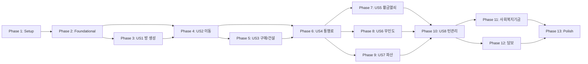

# Tasks: 부루마블 핵심 게임 엔진

**Input**: Design documents from `/specs/001-core-game-engine/`  
**Prerequisites**: plan.md ✓, spec.md ✓, data-model.md ✓, contracts/ ✓, research.md ✓, quickstart.md ✓

## Format: `[ID] [P?] [Story] Description`

- **[P]**: Can run in parallel (different files, no dependencies)
- **[Story]**: Which user story this task belongs to (e.g., US1, US2...US8)
- Paths: `server/src/` for backend, `client/` for frontend (Mobile + API structure)

---

## Dependency Graph

---

## Phase 1: Setup (Project Initialization)

**Purpose**: NestJS 서버 및 Expo 클라이언트 프로젝트 초기화

- [ ] T001 Create monorepo structure with `server/` and `client/` directories
- [ ] T002 Initialize NestJS 10 project in `server/` with TypeScript configuration
- [ ] T003 [P] Initialize Expo SDK 50 project in `client/` with TypeScript template
- [ ] T004 [P] Add Socket.IO dependency to `server/package.json`
- [ ] T005 [P] Add zustand, socket.io-client, expo-camera to `client/package.json`
- [ ] T006 [P] Configure ESLint and Prettier for both projects

---

## Phase 2: Foundational (Blocking Prerequisites)

**Purpose**: 모든 User Story가 의존하는 핵심 인프라 (MUST complete before ANY user story)

**⚠️ CRITICAL**: 이 Phase 완료 전 User Story 작업 불가

### Server Core

- [ ] T007 Create shared enums in `server/src/models/enums.ts` (GameStatus, TileType, BuildingLevel, CardEffectType, TransactionReason, TurnPhase)
- [ ] T008 [P] Create GameRoom interface in `server/src/models/game-room.ts` (includes fundPool for 사회복지기금)
- [ ] T009 [P] Create Player interface in `server/src/models/player.ts`
- [ ] T010 [P] Create BoardTile interface in `server/src/models/board-tile.ts` (5단계 통행료, canBuild)
- [ ] T011 [P] Create GoldenKeyCard interface in `server/src/models/golden-key-card.ts`
- [ ] T012 [P] Create Transaction interface in `server/src/models/transaction.ts`
- [ ] T013 Create models index in `server/src/models/index.ts` (re-export all)
- [ ] T014 [P] Copy board data to `server/src/constants/board-data.ts` (40칸, 29개 증서, 사회복지기금 2칸)
- [ ] T015 [P] Copy golden key cards to `server/src/constants/golden-key-cards.ts` (27종)
- [ ] T016 Create Game module in `server/src/game/game.module.ts`

### Client Core

- [ ] T017 [P] Create socket service in `client/services/socketService.ts`
- [ ] T018 [P] Create Zustand game store in `client/stores/gameStore.ts`
- [ ] T019 [P] Copy game constants to `client/constants/gameConstants.ts` (40칸, Game Constants)

**Checkpoint**: 서버/클라이언트 기본 구조 완료, User Story 구현 시작 가능

---

## Phase 3: User Story 1 - 게임방 생성 및 입장 (Priority: P1) 🎯 MVP

**Goal**: 플레이어가 새로운 게임방을 생성하거나 기존 방에 입장하여 게임을 시작할 수 있다

**Independent Test**: 4명이 각자의 기기에서 같은 방에 입장하고, 각각 다른 색상의 말(빨강/파랑/노랑/흰색)이 배정되는 것을 확인

### Implementation for User Story 1

- [ ] T020 [P] [US1] Create room code generator utility in `server/src/utils/room-code.ts` (6자리 영숫자)
- [ ] T021 [US1] Implement GameService.createRoom in `server/src/game/game.service.ts`
- [ ] T022 [US1] Implement GameService.joinRoom in `server/src/game/game.service.ts`
- [ ] T023 [US1] Implement GameService.startGame in `server/src/game/game.service.ts` (랜덤 순서)
- [ ] T024 [US1] Implement WebSocket handlers (create-room, join-room, start-game) in `server/src/game/game.gateway.ts`
- [ ] T025 [US1] Add REST API endpoint POST /rooms in `server/src/game/game.controller.ts`
- [ ] T026 [P] [US1] Create CreateRoom screen in `client/app/room/create.tsx`
- [ ] T027 [P] [US1] Create JoinRoom screen in `client/app/room/[code].tsx`
- [ ] T028 [US1] Implement room state management in `client/stores/gameStore.ts`

**Checkpoint**: 방 생성/입장/게임 시작 완료. 다음 User Story로 진행 가능.

---

## Phase 4: User Story 2 - 주사위 굴리기 및 이동 (Priority: P1) 🎯 MVP

**Goal**: 자신의 턴에 주사위 결과를 입력하고, 도착지 QR 스캔으로 이동 완료

**Independent Test**: 주사위 결과 7 입력 후 7칸 떨어진 QR 스캔하면 위치 업데이트, 잘못된 QR 스캔 시 에러

### Implementation for User Story 2

- [ ] T029 [US2] Implement GameService.rollDice in `server/src/game/game.service.ts`
- [ ] T030 [US2] Implement GameService.validateQrScan in `server/src/game/game.service.ts` (QR 검증)
- [ ] T031 [US2] Implement GameService.movePlayer in `server/src/game/game.service.ts` (40칸 이동, 출발 통과 시 월급)
- [ ] T032 [US2] Implement WebSocket handlers (roll-dice, scan-qr) in `server/src/game/game.gateway.ts`
- [ ] T033 [P] [US2] Create DiceInput component in `client/components/DiceInput.tsx`
- [ ] T034 [P] [US2] Create QRScanner component in `client/components/QRScanner.tsx`
- [ ] T035 [US2] Create GameBoard screen in `client/app/(tabs)/game.tsx`
- [ ] T036 [P] [US2] Create BoardView component in `client/components/BoardView.tsx` (40칸 시각화)

**Checkpoint**: 주사위 입력/QR 스캔/이동 검증 완료. 다음 User Story로 진행 가능.

---

## Phase 5: User Story 3 - 땅 구매 및 건물 건설 (Priority: P1) 🎯 MVP

**Goal**: 빈 땅 구매 및 소유한 땅에 건물(별장, 별장2, 빌딩, 호텔) 건설

**Independent Test**: 빈 땅 도착 시 구매 버튼 활성화, 구매 후 소유 표시, 재방문 시 건설 옵션 제공

### Implementation for User Story 3

- [ ] T037 [US3] Implement GameService.buyProperty in `server/src/game/game.service.ts`
- [ ] T038 [US3] Implement GameService.buildOnProperty in `server/src/game/game.service.ts` (5단계 건물)
- [ ] T039 [US3] Add no-build validation for special properties in `server/src/game/game.service.ts` (제주도, 부산, 서울, 탈것)
- [ ] T040 [US3] Implement WebSocket handlers (buy-property, build) in `server/src/game/game.gateway.ts`
- [ ] T041 [P] [US3] Create PropertyCard component in `client/components/PropertyCard.tsx`
- [ ] T042 [P] [US3] Create BuildOptionModal in `client/components/BuildOptionModal.tsx`

**Checkpoint**: 구매/건설 완료. 통행료 계산에 필요한 기반 완료.

---

## Phase 6: User Story 4 - 통행료 지불 (Priority: P1) 🎯 MVP

**Goal**: 타인 소유 땅 도착 시 5단계 통행료 자동 계산 및 지불, 독점 시 2배

**Independent Test**: 타인 소유 땅(호텔 있음) 도착 시 통행료 팝업, 확인 시 자동 이체

### Implementation for User Story 4

- [ ] T043 [US4] Implement RentCalculator in `server/src/utils/game-logic.ts` (5단계 통행료, 독점 2배, 담보 0원)
- [ ] T044 [US4] Implement GameService.payRent in `server/src/game/game.service.ts`
- [ ] T045 [US4] Implement WebSocket handler (pay-rent) in `server/src/game/game.gateway.ts`
- [ ] T046 [P] [US4] Create RentPaymentModal in `client/components/RentPaymentModal.tsx`
- [ ] T047 [P] [US4] Create PlayerCard component in `client/components/PlayerCard.tsx` (자산 표시)

**Checkpoint**: 🎯 **MVP COMPLETE** - 핵심 게임 루프(방 생성→이동→구매→통행료) 완료

---

## Phase 7: User Story 5 - 황금열쇠 이벤트 처리 (Priority: P2)

**Goal**: 황금열쇠 칸 도착 시 27종 카드 효과 적용 (이동, 상금, 지출, 유지비 등)

**Independent Test**: 황금열쇠 칸 도착 → 카드 표시 → 효과 적용 (이동 카드는 QR 락)

### Implementation for User Story 5

- [ ] T048 [US5] Implement GoldenKeyService in `server/src/game/golden-key.service.ts` (27종 효과)
- [ ] T049 [US5] Implement card effects: MOVE_TO, MOVE_BACK, WORLD_TOUR in `server/src/game/golden-key.service.ts`
- [ ] T050 [US5] Implement card effects: RECEIVE, PAY, COLLECT_FROM_ALL in `server/src/game/golden-key.service.ts`
- [ ] T051 [US5] Implement card effects: BUILDING_FEE, FORCE_SELL in `server/src/game/golden-key.service.ts`
- [ ] T052 [US5] Implement holdable card logic (탈출권, 우대권) in `server/src/game/golden-key.service.ts`
- [ ] T053 [US5] Implement WebSocket handler (draw-card, use-holdable-card) in `server/src/game/game.gateway.ts`
- [ ] T054 [P] [US5] Create GoldenKeyModal in `client/components/GoldenKeyModal.tsx`

**Checkpoint**: 황금열쇠 27종 효과 완료.

---

## Phase 8: User Story 6 - 무인도/감옥 처리 (Priority: P2)

**Goal**: 무인도 갇힘 시 3가지 탈출 옵션 (더블, 비용 지불, 탈출권 사용) 및 3턴 대기 후 자동 탈출

**Independent Test**: 무인도 도착 → 탈출 옵션 표시 → 선택에 따른 올바른 처리

### Implementation for User Story 6

- [ ] T055 [US6] Implement GameService.sendToIsland in `server/src/game/game.service.ts`
- [ ] T056 [US6] Implement GameService.handleIslandTurn in `server/src/game/game.service.ts` (4가지 옵션: double, pay, card, wait)
- [ ] T057 [US6] Implement WebSocket handler (island-action) in `server/src/game/game.gateway.ts`
- [ ] T058 [P] [US6] Create IslandEscapeModal in `client/components/IslandEscapeModal.tsx`

**Checkpoint**: 무인도 로직 완료.

---

## Phase 9: User Story 7 - 파산 처리 (Priority: P2) ⚠️ QUALITY GATE

**Goal**: 지불 불가 시 파산 선언, 자산 채권자/은행 귀속, 1명 남으면 승리

**Independent Test**: 지불 불가 → 파산 선언 → 자산 이전 → 승자 결정

### Implementation for User Story 7

- [ ] T059 [US7] Implement GameService.declareBankruptcy in `server/src/game/game.service.ts`
- [ ] T060 [US7] Implement asset transfer logic (채권자/은행) in `server/src/game/game.service.ts`
- [ ] T061 [US7] Implement GameService.checkGameEnd in `server/src/game/game.service.ts`
- [ ] T062 [US7] **[QUALITY GATE]** Create bankruptcy unit tests in `server/tests/unit/bankruptcy.spec.ts`
- [ ] T063 [US7] Implement WebSocket handler (declare-bankruptcy) in `server/src/game/game.gateway.ts`
- [ ] T064 [P] [US7] Create BankruptcyModal in `client/components/BankruptcyModal.tsx`
- [ ] T065 [P] [US7] Create GameEndModal in `client/components/GameEndModal.tsx`

**Checkpoint**: 파산 로직 및 필수 Unit Test 완료.

---

## Phase 10: User Story 8 - 턴 관리 및 연결 복원 (Priority: P3)

**Goal**: 명시적 턴 종료 및 연결 끊김 시 일시 정지/재연결/이탈 처리

**Independent Test**: 턴 종료 → 다음 플레이어, 연결 끊김 → 일시 정지 → 3분 후 이탈 처리

### Implementation for User Story 8

- [ ] T066 [US8] Implement GameService.endTurn in `server/src/game/game.service.ts`
- [ ] T067 [US8] Implement connection monitoring in `server/src/game/game.gateway.ts` (handleConnection, handleDisconnect)
- [ ] T068 [US8] Implement GameService.pauseGame / resumeGame in `server/src/game/game.service.ts`
- [ ] T069 [US8] Implement 3-minute disconnect timeout scheduler in `server/src/game/game.service.ts`
- [ ] T070 [US8] **[QUALITY GATE]** Create connection resilience tests in `server/tests/integration/connection.spec.ts`
- [ ] T071 [US8] Implement WebSocket handlers (end-turn, reconnect) in `server/src/game/game.gateway.ts`
- [ ] T072 [P] [US8] Create DisconnectModal in `client/components/DisconnectModal.tsx`

**Checkpoint**: 턴 관리 및 연결 복원 완료.

---

## Phase 11: 사회복지기금 적립 시스템 (Priority: P2)

**Goal**: 기부 칸(index 38)에서 150,000원 적립, 수령처(index 20)에서 적립금 전액 수령

**Independent Test**: 기부 칸 도착 → 150,000원 차감 → fundPool 증가, 수령처 도착 → fundPool 전액 지급

### Implementation

- [ ] T073 Implement FundService.donate in `server/src/game/fund.service.ts`
- [ ] T074 Implement FundService.receive in `server/src/game/fund.service.ts`
- [ ] T075 Integrate fund logic in GameService.handleLanding in `server/src/game/game.service.ts`
- [ ] T076 [P] Create FundPoolDisplay in `client/components/FundPoolDisplay.tsx` (적립금 표시)

**Checkpoint**: 사회복지기금 적립 시스템 완료.

---

## Phase 12: 담보 설정/해제 (Priority: P1)

**Goal**: 담보 설정 시 구매가 50% 지급, 건물 포함 시 건물가 50% 추가, 해제 시 10% 이자

**Independent Test**: 담보 설정 → 50% 지급, 해제 → 110% 지불, 담보 땅 통행료 0원

### Implementation

- [ ] T077 Implement MortgageService.setMortgage in `server/src/game/mortgage.service.ts`
- [ ] T078 Implement MortgageService.releaseMortgage in `server/src/game/mortgage.service.ts`
- [ ] T079 Integrate mortgage in RentCalculator (담보 땅 0원) in `server/src/utils/game-logic.ts`
- [ ] T080 Implement WebSocket handlers (set-mortgage, release-mortgage) in `server/src/game/game.gateway.ts`
- [ ] T081 [P] Create MortgageModal in `client/components/MortgageModal.tsx`

**Checkpoint**: 담보 로직 완료.

---

## Phase 13: 우주여행 및 특수 칸 (Priority: P2)

**Goal**: 우주여행 도착 시 40칸 중 원하는 곳 이동 (이용료 20만), 탈것 칸 통행료

**Independent Test**: 우주여행 도착 → 이용료 지불 → 목적지 선택 → QR 스캔 이동

### Implementation

- [ ] T082 Implement TravelService.useTravel in `server/src/game/travel.service.ts`
- [ ] T083 Implement vehicle rent logic in RentCalculator in `server/src/utils/game-logic.ts`
- [ ] T084 Implement WebSocket handler (use-travel) in `server/src/game/game.gateway.ts`
- [ ] T085 [P] Create TravelModal in `client/components/TravelModal.tsx`

**Checkpoint**: 우주여행 및 탈것 완료.

---

## Phase 14: Polish & Cross-Cutting Concerns

**Purpose**: 통합 테스트, UI 개선, 에러 핸들링 강화

- [ ] T086 Create integration test for full game flow in `server/tests/integration/game-flow.spec.ts`
- [ ] T087 **[QUALITY GATE]** Create QR validation tests in `server/tests/integration/qr-validation.spec.ts`
- [ ] T088 [P] Add error boundary and toast notifications in `client/app/_layout.tsx`
- [ ] T089 [P] Add loading states and skeleton UI in `client/components/`
- [ ] T090 Create transaction history display in `client/components/TransactionHistory.tsx`
- [ ] T091 Performance optimization: memoize components in `client/components/`

**Checkpoint**: 🎉 **FEATURE COMPLETE** - 모든 User Story 및 Quality Gate 완료

---

## Implementation Strategy

### MVP Scope (Phases 1-6)

| Phase | Priority | User Story        | Min Tasks |
| ----- | -------- | ----------------- | --------- |
| 1     | -        | Setup             | 6         |
| 2     | -        | Foundational      | 13        |
| 3     | P1       | US1: 방 생성/입장 | 9         |
| 4     | P1       | US2: 이동         | 8         |
| 5     | P1       | US3: 구매/건설    | 6         |
| 6     | P1       | US4: 통행료       | 5         |

**MVP Total**: 47 tasks (T001-T047)

### Full Scope (Phases 7-14)

| Phase | Priority | User Story    | Min Tasks |
| ----- | -------- | ------------- | --------- |
| 7     | P2       | US5: 황금열쇠 | 7         |
| 8     | P2       | US6: 무인도   | 4         |
| 9     | P2       | US7: 파산     | 7         |
| 10    | P3       | US8: 턴관리   | 7         |
| 11    | P2       | 사회복지기금  | 4         |
| 12    | P1       | 담보          | 5         |
| 13    | P2       | 우주여행      | 4         |
| 14    | -        | Polish        | 6         |

**Full Total**: 91 tasks

### Parallel Execution Opportunities

| Phase | Parallelizable         | Examples                  |
| ----- | ---------------------- | ------------------------- |
| 1     | T003, T004, T005, T006 | Client/Server 독립 초기화 |
| 2     | T008-T015, T017-T019   | 모델/상수 파일들          |
| 3     | T020, T026, T027       | 유틸리티/UI 컴포넌트      |
| 4     | T033, T034, T036       | UI 컴포넌트들             |
| 7     | T054                   | GoldenKeyModal            |

### Quality Gates (MANDATORY)

| Gate      | Task | Description                |
| --------- | ---- | -------------------------- |
| 파산 로직 | T062 | bankruptcy.spec.ts 필수    |
| 연결 복원 | T070 | connection.spec.ts 필수    |
| QR 검증   | T087 | qr-validation.spec.ts 필수 |
